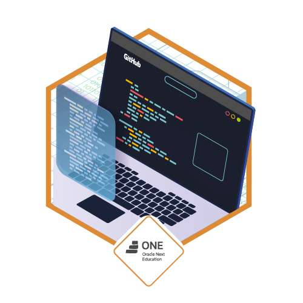

# Desafio Amigo Secreto

Este projeto foi desenvolvido como parte do desafio do programa **Oracle ONE**, em parceria com a **Alura**. O objetivo é fortalecer as habilidades de lógica de programação e manipulação do DOM usando JavaScript, HTML e CSS.

---

## Descrição do Desafio

Criar uma aplicação web simples que permita ao usuário:

- Inserir nomes de amigos em uma lista dinâmica.
- Validar entradas para evitar nomes vazios.
- Exibir a lista de amigos adicionados na página.
- Sortear aleatoriamente um amigo secreto entre os nomes cadastrados.
- Exibir o resultado do sorteio de forma clara e acessível.

---

## Tecnologias Utilizadas

- **HTML5** para a estrutura da página.
- **CSS3** para estilização visual.
- **JavaScript** para a lógica de interação e manipulação dinâmica da página.

---

## Funcionalidades

- **Adicionar amigo:** Captura o nome digitado, valida se não está vazio e adiciona à lista.
- **Atualizar lista:** Exibe em tempo real os nomes adicionados.
- **Sortear amigo:** Escolhe aleatoriamente um nome da lista de amigos cadastrados e mostra o resultado.
- **Validação:** Evita nomes vazios e alerta o usuário.

---

